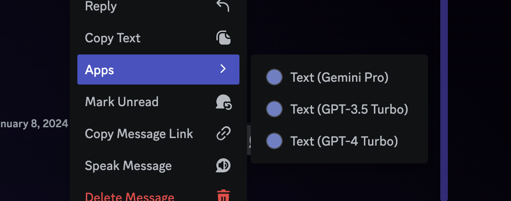

# Text Generation

ichiyoAI は ChatGPT, Gemini を利用したテキスト生成に対応しています.

- [使用方法](#使用方法)
- [返信モード](#返信モード)
- [注意事項](#注意事項)

## 使用方法

ichiyoAI に送信するプロンプトメッセージに対して Message Command を送信することで, テキスト生成を行うことができます.

Message Command は以下のように構成されています. 使用するモデルに合わせてコマンドを選んでください.

| モデル | コマンド |
| --- | --- |
| GPT-4 Turbo | `Text (GPT-4 Turbo)` |
| GPT-3.5 Turbo | `Text (GPT-3.5 Turbo)` |
| Gemini Pro | `Text (Gemini Pro)` |

( `GPT-4 Turbo` は限界税への納税が必要です. 詳しくは [こちら](../premium-access.md) を参照してください.)

Message Command はメッセージに対して右クリック (モバイル版では長押し) すると表示されるコンテキストメニューから利用できます.

## 返信モード

ichiyoAI のメッセージに対してメンション付きで返信し, そのメッセージに対して Message Command を使用すると返信元のリプライまで ChatGPT, Gemini が理解した上で応答します.

## 注意事項

- v1.21.1 以前に利用できたメンションでの Text Generation は廃止されました. かわりに [Message Command](#使用方法) を利用してください.
- API 側からのレスポンスの文字数が 2000 文字を超えた場合, Discord API の仕様上 ichiyoAI は返信せずに終了します.
- API へリクエストを送ってから3分以上かかった場合は自動的にタイムアウトになります。もう一度送るか、内容を見直してみてください。
