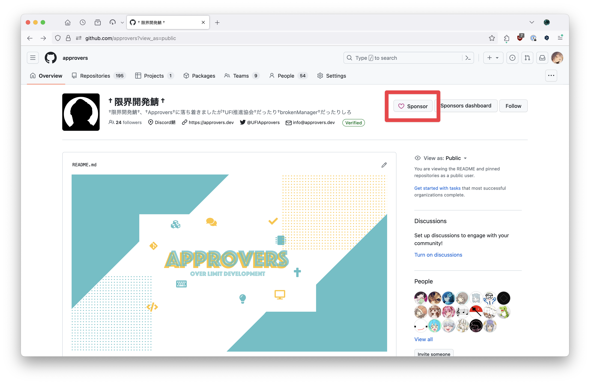
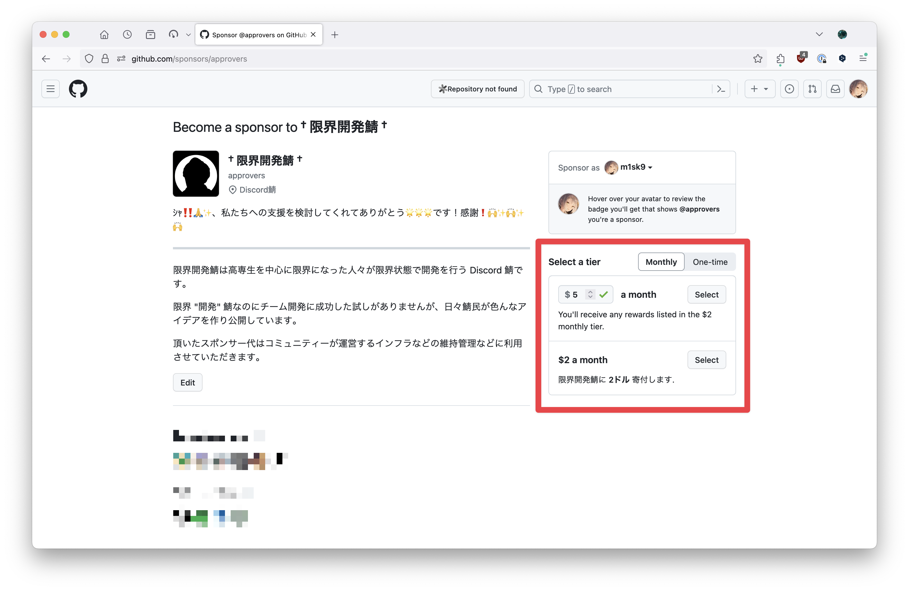

# プレミアムアクセス

ichiyoAI が使用するモデルは, すべて API を利用しています. それらのモデルは無料で利用しているわけではなく限界開発鯖の GitHub Sponsors **限界税** からお金を出して契約しています.

ichiyoAI では一部のモデルにおいて **限界税** を納税したユーザーのみがアクセスできる **プレミアムアクセス** を提供しています.

> **注意:**
> 限界税を納税しなくても ichiyoAI の全機能 (GPT-3.5, Gemini, DALL-E 2) は利用できます.

- [利用できるモデル一覧](#利用できるモデル一覧)
- [モデルの比較](#モデルの比較)
- [納税方法](#納税方法)
  - [GitHub Sponsors から納税する](#github-sponsors-から納税する)
  - [限界開発鯖 Discord にサーバーブーストする](#限界開発鯖-discord-にサーバーブーストする)

## 利用できるモデル一覧

- GPT-4 Turbo
- DALL-E 3

## モデルの比較

[モデル](./model.md) を参照してください.

## 納税方法

納税の方法は大きく分けて2つあります.

1. GitHub Sponsors から納税する
2. 限界開発鯖 Discord にサーバーブーストする

本来限界税は `1` のみが正式な方法ですが, ichiyoAI は `2` の方法にも対応しています. Containers2 を利用するには `1` での納税が必須です.

### GitHub Sponsors から納税する

1. 限界開発鯖 の [GitHub Sponsors ページ](https://github.com/sponsors/approvers) にアクセスします.

2. `Monthly` (毎月) または `One-time` (一度きり) を選択し, $2 以上の金額を入力します.

3. `Select` をクリックし, 画面の指示に従います.
4. 限界開発鯖 Discord を開き, `Linked Role` (連携ロール) をクリックし, **Sponsor** App と Discord アカウントを連携する.
5. 自分のロールに `Sponsor` が追加されていることを確認します. 追加されているのを確認したら `@m1sk9` (める) にメンションして納税者ロールをもらってください.

### 限界開発鯖 Discord にサーバーブーストする

Discord におけるサーバーブーストの方法は [こちら](https://support.discord.com/hc/ja/articles/360028038352) から確認できます.
